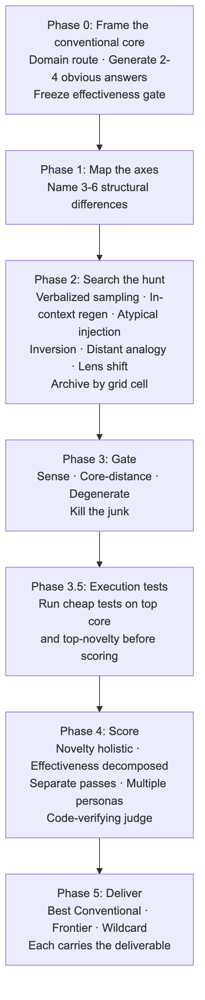
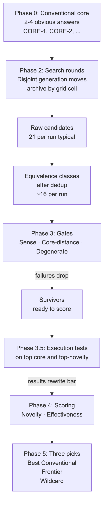
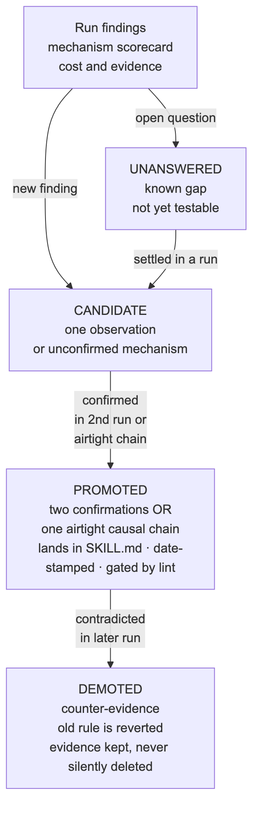

# Novelty Hunt

**Find genuinely original candidates while protecting them from the quality filter that normally kills them.** One measured finding at a time: every rule traces to a measured constant, and open questions stay listed as UNANSWERED rather than filled with invented numbers.

[](LICENSE)
[](references/lessons.md)
[](#requirements)
[](https://neonpeach.co)

Most brainstorm-then-pick workflows fail twice. The generation step produces paraphrases of the obvious answer. The scoring step buries whatever originality survived. Every mechanism in this skill is built against both failures.

<picture>
  <source media="(prefers-color-scheme: dark)" srcset="diagrams/phases-dark.png">
  
</picture>

**Contents:** [Why](#why-this-exists) · [How it works](#how-it-works) · [Field record](#field-record) · [Quick start](#quick-start) · [Install](#install) · [Using it](#using-it) · [Layout](#repository-layout) · [Self-maintenance](#the-skill-maintains-itself) · [Design notes](#design-notes) · [Contributing](#contributing) · [Maintainer](#maintainer)

## Why this exists

Aligned models are mode-collapsed. Preference tuning sharpens output toward the familiar. Measured on a Tulu-70B, the base model retained 45.4% semantic diversity, 20.8% after SFT, 10.8% after DPO. Frontier models produce fewer than 4 functionally distinct answers in 10 samples, and bigger models collapse harder. Temperature does not fix it.

Judges are biased against the thing you asked for. Selecting on quality is selecting against novelty (r = −0.27 to −0.48 between novelty and capability benchmarks). Zero-shot LLM judging of originality agrees with experts at roughly chance (Cohen's kappa 0.02 to 0.04). LLM judges rate AI-typical polish up and semantic surprise down, the exact inversion of expert judgment.

Novelty-hunt answers both with structure rather than better prompts. It protects originality structurally — through the archive that preserves diverse candidates — rather than through a scoring step. And it scores honestly by demanding separate passes for novelty and effectiveness, multiple personas with raw input rather than digested summaries, and code-verifying judges for checkable claims.

## How it works

Six phases, lightweight by default.

**Phase 0 — Frame the conventional core.** Before generating anything original, plainly generate 2 to 4 obvious answers a competent practitioner would give. These form the reference set that novelty gets measured against. Freeze the effectiveness gate here, before searching. The gate is only as good as the evidence frozen into it; anchored questions written after seeing candidates become rationalizations.

**Phase 1 — Map the axes.** Name 3 to 6 structural axes along which solutions could differ. These form the archive grid; with several axes, most candidates land in fresh cells and the grid records where they differ.

**Phase 2 — Search the hunt.** Run rounds of generation moves — verbalized sampling (1.6 to 2.1x measured diversity gain), in-context regeneration, atypical injection, inversion, distant analogy, persona shifts — archiving best candidate per grid cell. Rounds stop when nothing new appears. Disjoint generators in full mode mean no generator sees another's output; convergence on the same class by independent generators is itself a quality signal.

**Phase 3 — Gate.** Cheap pass-fail on every candidate in order: sense (91% of maximally-rare output is junk), core-distance (actually distinct from every CORE item), degenerate (no mechanism, just a label). Failures die here. Nothing in this phase scores novelty; a gate is not a rating.

**Phase 3.5 — Execution tests.** Run cheap tests on the top conventional and top-novelty candidates before any scoring. Proposal-stage advantages reverse under execution: in recorded runs, execution tests overturned both odds-on favorites at zero API cost, and a test failure itself is a generator — reading the code at the failure point surfaces candidates no prompting move produced.

**Phase 4 — Score.** Novelty is judged holistically after a forced "what exactly is original here" analysis. Effectiveness is judged by the decomposed Phase 0 anchors. Separate passes, because LLM judges collapse any multi-dimension rubric into one latent score. Batch-relative, blind, "multiple valid solutions exist" framing, randomized order, code-verifying judge for checkable claims.

**Phase 5 — Deliver.** Three named picks. Best Conventional (top of the core), Frontier (novel and effective and atypical), and Wildcard (highest novelty, never auto-dropped, because judges are structurally blind to the transformative tail). Each carries the deliverable in the form the user asked for.

<p align="center">
<picture>
  <source media="(prefers-color-scheme: dark)" srcset="diagrams/candidates-dark.png">
  
</picture>
</p>

The hit-shape target comes from 17.9M papers: winning work is a highly conventional core plus one injected atypical element, peaking at the 85th to 95th percentile of conventionality. The skill hunts for the atypical injection, not for wall-to-wall weirdness.

## Field record

The first full-mode field run (2026-08-14) produced nine promoted lessons. The headlines.

**Execution tests beat judges, twice in one run.** A five-minute test killed the conventional favorite before scoring. A second test falsified the naive form of the top-novelty candidate. That promoted execution testing from a delivery-phase footnote to its own pre-scoring phase.

**A same-model persona panel is one judge with three voices.** Three personas produced zero disputes across 20 candidates while their unanimous number one rested on a premise a single grep disproved. The skill now says so in its own output, feeds judges the raw generator text instead of one author's summary, and requires a judge to verify any checkable factual claim.

**The panel ranking is a hypothesis, not a result.** In three consecutive recorded runs, the scored winner did not survive adversarial review unchanged. The ranking now routes to a red team before it goes to the user, and under a fixed budget the panel is the first thing cut, never the generators, the execution tests, or the red team.

**Generation is the strongest phase.** Four generators with disjoint moves and no visibility into each other turned 33 candidates into 20 functionally distinct classes, with four-way independent convergence on the class that mattered.

## Quick start

Three commands and one sentence.

```bash
git clone https://github.com/rwshiraishi/novelty-hunt ~/dev/novelty-hunt
mkdir -p ~/.claude/skills
ln -s ~/dev/novelty-hunt ~/.claude/skills/novelty-hunt
```

Then, inside Claude Code, for a problem where conventional answers have failed or the field feels exhausted:

> Run the novelty hunt on this: we need a positioning line for our data-viz SaaS that goes beyond the standard "powerful, flexible, collaborative" field.

You get back a structured candidate archive (Phase 2), gated survivors (Phase 3), scored picks (Phase 4 results table), and three named deliverables: the best conventional answer, a frontier candidate (novel and effective and atypical), and a wildcard (highest novelty, tested before delivery).

## Install

### Requirements

- An agent harness that can spawn subagents and execute commands. Claude Code is the primary target.
- Python 3 for the self-lint script. Nothing else. No build step, no dependencies.
- Node 18 or newer only if you want to regenerate the README diagrams.

### Claude Code

Novelty-hunt is a skill: one markdown file, four reference documents, optional diagrams, and one lint script. Claude Code discovers skills in `~/.claude/skills/<name>/SKILL.md` (global) or `.claude/skills/<name>/SKILL.md` (per project).

**Option A, symlink (recommended).** Updates arrive with `git pull`.

```bash
git clone https://github.com/rwshiraishi/novelty-hunt ~/dev/novelty-hunt
mkdir -p ~/.claude/skills
ln -s ~/dev/novelty-hunt ~/.claude/skills/novelty-hunt
```

**Option B, copy.** Frozen at the version you copied.

```bash
git clone https://github.com/rwshiraishi/novelty-hunt /tmp/novelty-hunt
mkdir -p ~/.claude/skills/novelty-hunt
cp -r /tmp/novelty-hunt/. ~/.claude/skills/novelty-hunt/
```

**Project-scoped instead of global.** Use `.claude/skills/novelty-hunt/` inside the repo with either option. A project copy wins over a global one.

**Verify the install.**

```bash
ls ~/.claude/skills/novelty-hunt/SKILL.md   # the skill file is where Claude Code looks
```

Then start a Claude Code session and ask "what skills do you have for finding original ideas?" Novelty-hunt should be listed.

**Update.**

```bash
cd ~/dev/novelty-hunt && git pull          # symlink install: done
# copy install: repeat the cp line above
```

**Uninstall.**

```bash
rm -rf ~/.claude/skills/novelty-hunt
```

### Any agent that reads a prompt

The pattern is prompt-level, not tool-level. Paste `SKILL.md` into a system prompt or project instructions. The only hard requirement is the ability to run more than one agent if full-mode is invoked; lightweight mode runs in a single session.

## Using it

**Invoke it in plain language.** "Find truly original ideas for this." "Run the novelty hunt on the positioning." "Unconventional options for the problem." Or ask for lightweight (fast, single-agent) or full mode (slow, subagent generators and judges, cross-model scoring).

**The only knob is mode.** Lightweight (default) runs in one agent at roughly 10 to 25k tokens. Full mode costs 40 to 90k and needs an explicit trigger. The skill includes a skip floor: for trivial asks, or when a conventional answer is plainly sufficient, it refuses to run and says why.

**What you get back.** An archive of candidates by grid cell, gated survivors, a scored results table (novelty 1-7, effectiveness 1-7, spread per dimension), and three picks with deliverables in the form you asked for.

**Know when not to use it.** If the ask is trivial (variable names, one-liner fixes), a conventional answer is obviously sufficient, or speed matters more than originality, answer directly and skip the hunt. A hunt costs more than the work for jobs that small. If a test fails, the hunt surfaces why in the artifact; the fix's neighbourhood often contains a candidate no generation move produced.

## Repository layout

```
SKILL.md                          the skill: six phases, calibration, scoring rules
references/
  generation-moves.md             search playbook with prompt templates for each move
  scoring-protocol.md             judge blocks, panel design, bias counters, framing
  evidence.md                     every measured constant and citations from the lit
  lessons.md                      the run ledger: field-tested rules and open questions
  research/                       17 underlying deep-research reports (2026-08 sweep)
diagrams/
  *.mmd, regen.sh, stamp.sh       README figures as Mermaid source plus pre-rendered PNGs
```

The evidence and lessons files are load-bearing. Every rule in SKILL.md traces to a measured constant, and unanswered questions stay listed as UNANSWERED instead of being filled with invented numbers.

## The skill maintains itself

Novelty-hunt treats its own doctrine the way it treats a problem: evidence, execution, amendment.

<p align="center">
<picture>
  <source media="(prefers-color-scheme: dark)" srcset="diagrams/lessons-lifecycle-dark.png">
  
</picture>
</p>

After every full-mode run, findings get appended to `references/lessons.md`. A lesson seen once is CANDIDATE. Confirmed twice or once with an airtight causal chain, it gets promoted into the skill files with a date stamp, gated by lint. Contradicted later, it gets demoted with the counter-evidence kept instead of deleted. Seven lessons are promoted, four remain candidates, and three are open questions from the first two recorded runs.

The skill's own lint gate checks lesson-ID sync between the index and evidence file, duplicate IDs, promoted rules that never name where they landed, and broken cross-references. Every check reports how many things it examined and fails at zero, obeying the rule it enforces.

## Design notes

**Measured constants, never invented.** Every rule has a citation. Open questions stay listed as UNANSWERED; a gap is more honest than a filled guess.

**Archive over filter.** Novel candidates are protected structurally, not left to survive a quality cut. The grid cell system preserves diversity by making junk and genius land in different cells.

**Separate dimensions, separate passes.** Novelty and effectiveness are judged on different calls. LLM judges collapse any multi-dimension rubric into one latent score if the option exists; structure helps only on effectiveness.

**Execution trumps scoring.** When a cheap test exists, it outranks every judge score. Proposal-stage advantages reverse under execution.

**Code-verified judgment.** Any checkable factual claim gets verified against the artifact. Judges receive raw generator text, not a filtered summary, because a single author's prose is a shared input no persona can decorrelate.

**Interop with solution-tournament.** Novelty-hunt generates; solution-tournament ranks for production fitness. Hand the hunt's archive to the tournament as its candidate field with novelty as a weighted dimension. Conversely, when the tournament's red team asks "name one credible absent approach," run the hunt as the remedy.

## Contributing

**Adding a lesson.** Add one row to `references/lessons.md` and one `## L-N<n> — <slug> — <status>` entry with the evidence in `references/lessons.md`. When adding a promoted lesson, make sure to cite where it landed (which line in SKILL.md or one of the references files).

**Changing a diagram.** Edit the `.mmd` source in `diagrams/`, then run `diagrams/regen.sh`. It renders light and dark PNGs for every source and rewrites the sync stamp. Never run the renderer by hand. See [`diagrams/README.md`](diagrams/README.md) for the rules learned the hard way.

## Prior art and credit

The generation-moves playbook draws from diversity-training literature and best-practice creative-thinking scaffolds (Osborn, Kounios & Beeman, Riegel's Morphological Box). The bias-controlled scoring reflects Amabile's CAT protocol and recent work on framing effects in LLM judgment (Mueller et al., Ismayilzada et al.). The "hit shape" targeting (85th-95th percentile conventionality) is Uzzi et al.'s core finding from 17.9M papers.

## Maintainer

Novelty-hunt is built and maintained by [Neon Peach, LLC](https://neonpeach.co). Author: [Ray Shiraishi, Ph.D.](https://www.linkedin.com/in/ray-w-shiraishi-ph-d-780276331) Bug reports, field retros, and pull requests are welcome here on GitHub.

## License

MIT, copyright Neon Peach, LLC. See [LICENSE](LICENSE).
